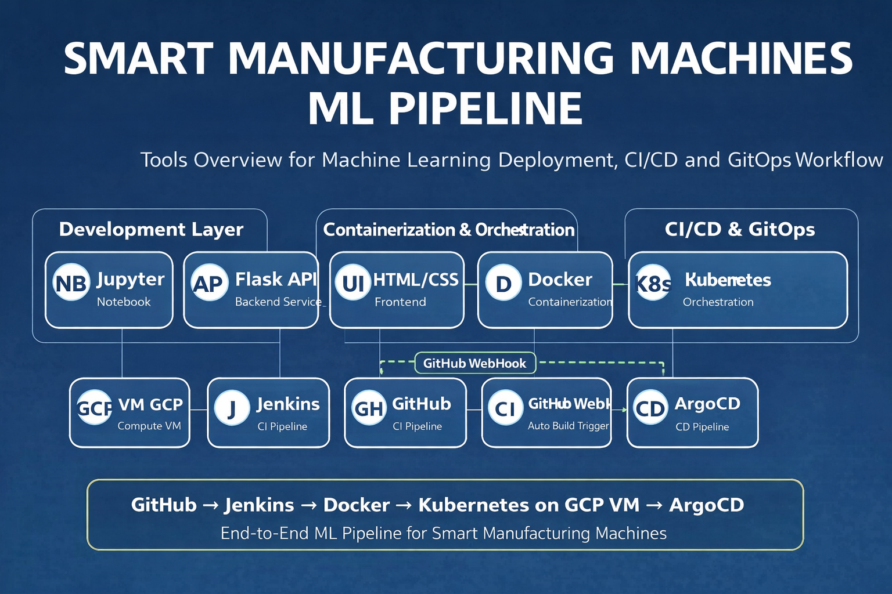
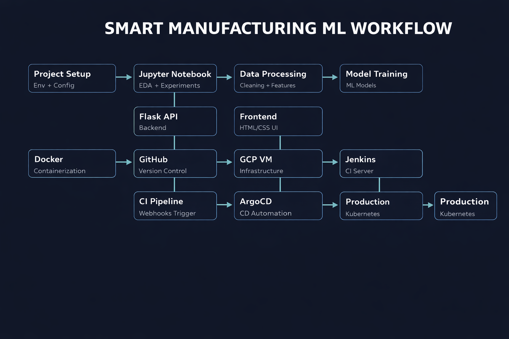

# 🚀 Smart Manufacturing MLOps Platform

A production-grade MLOps + GitOps platform for smart manufacturing use cases.

---

## 📌 Project Overview
This project demonstrates an end-to-end ML system:
- ML lifecycle (EDA → Training → Deployment)
- CI/CD with Jenkins
- GitOps with ArgoCD
- Docker + Kubernetes deployment
- GCP VM infrastructure

---

## 🧠 Key Highlights
- End-to-end ML pipeline
- Flask API deployment
- Dockerized service
- Kubernetes orchestration
- Jenkins CI with GitHub Webhooks
- ArgoCD CD pipeline

---

## 🧰 Tech Stack

### ML
- Python, Jupyter, Scikit-learn

### App
- Flask API
- HTML, CSS

### DevOps
- Docker
- Kubernetes
- Jenkins
- ArgoCD

### Cloud
- GCP VM

---

## 🖼️ Tools Overview


---

## 🔄 End‑to‑End Workflow
Data Processing & Model Training → Flask API → Docker → GitHub → Jenkins CI → ArgoCD CD → Kubernetes (GCP VM)


---

## ⚙️ Setup

### Clone
```
git clone https://github.com/hossain-sanowar/smart-manufacturing-mlops-platform
cd smart-manufacturing-mlops-platform
```

### Virtual Env
```
python -m venv venv
venv\Scripts\activate
```

### Install
```
pip install -r requirements.txt
```

### Run
```
python app/main.py
```

---

## 🐳 Docker
```
docker build -t smart-ml-app .
docker run -p 5000:5000 smart-ml-app
```

---

## ⚙️ CI/CD Flow
1. Push code → GitHub
2. Webhook → Jenkins
3. Build + Test
4. Deploy via ArgoCD
5. Run on Kubernetes

---

## ☁️ Kubernetes
```
kubectl apply -f deploy/k8s/
```

---

## 🎯 Use Case
- Machine efficiency prediction
- Predictive maintenance
- Smart manufacturing optimization

---

## 👨‍💻 Author

Md Sanowar Hossain
Machine Learning Engineer | Applied AI

GitHub: https://github.com/hossain-sanowar
LinkedIn: https://www.linkedin.com/in/HossainSanowar

---
## 🏷️ License
This project is open‑source under the MIT License.
Feel free to use, modify, and contribute.
